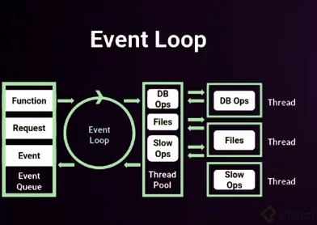

# Event Loop

Es un proceso que actúa como un bucle y se gestiona de forma automática. Todo lo que sucede en la aplicación funciona de manera [asíncrona](Asincronía.md), asegurando que el bucle no se bloquee y que todo lo que se le envíe se ejecute por separado. El bucle puede seguir recibiendo peticiones. Por esta razón, Node.js se considera altamente escalable y se utiliza en muchas aplicaciones que requieren múltiples operaciones de entrada y salida. Podemos imaginarlo como un círculo girando, donde los eventos provienen de la cola de eventos o Event Queue.

## Event Queue:
Contiene todo lo que se ejecuta en el código y lo envía uno por uno al event loop, donde se procesarán.

## Thread Pool:
En caso de que no se resuelva rápidamente, se enviará al Thread Pool, donde se gestionará de forma asíncrona. Lo que hace es iniciar un nuevo hilo que se encargará de ejecutar el proceso. Una vez que el Thread Pool haya terminado de ejecutar el proceso, disparará un evento y volverá al Event Loop y, si es necesario, a la Event Queue.

El funcionamiento asíncrono nos permite evitar que el hilo principal se bloquee, ya que las operaciones más lentas, como las consultas a bases de datos o la lectura de archivos, se seguirán ejecutando en su propio hilo. Cada hilo se encargará de gestionar sus procesos lentos.

Esto diferencia a Node.js de otros lenguajes como PHP, Python o Java, que son síncronos y realizan las operaciones una detrás de la otra.

